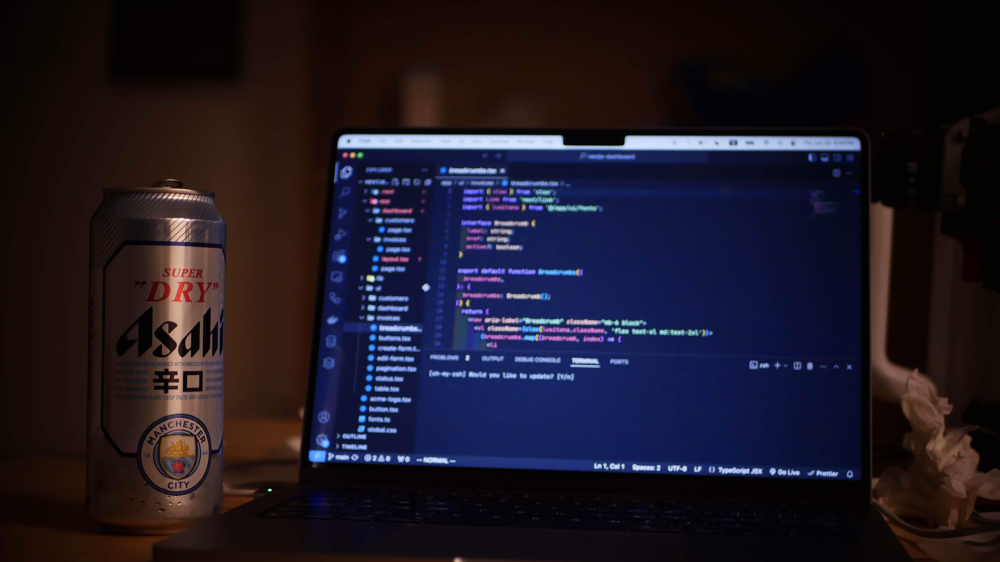

## Hello my friends! こんにちは! 👋
<!--  -->

  
  

## About me 😼
I am a software engineer with 4 years of experience in Java💻. Different from my peers, I am a self-taught developer and I am always looking for new challenges and opportunities to learn and grow💪. When I am not crushing bugs, I enjoy listening to Jazz🎷, cooking🍳, and taking photos📸.

## Coding Cookbook Recipes 📚

## Life Scramble 🎲
- 🔭 I’m currently working on Master in Computer Science at Johns Hopkins University in Baltimore, MD
- 🌱 I’m currently learning TypeScript Full Stack Development, AI, and Web3 Development
- 🌎 Still be curious about the world. Also I am learning Japanese 🇯🇵. いろいろなことを学びたいです
- 😅 Tried switch to Dvorak layout but failed
- 📩 Reach me on [LinkedIn](https://www.linkedin.com/in/wontonion/) 💬 Or ask me about anything [here](https://github.com/wontonion/wontonion/issues)
